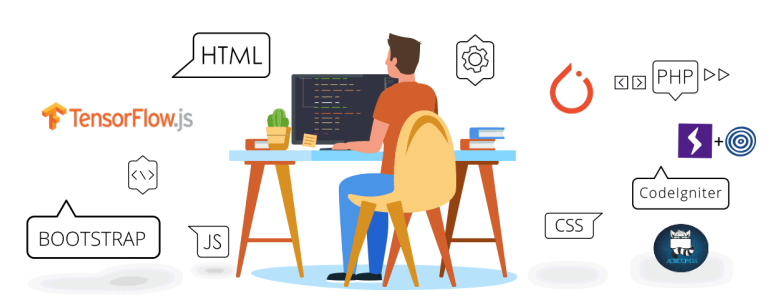

<h1 align="center">Cristhian Wiki</h1>

  

  
  
  
  

  

## About me

- ML and AI engineer. I build deep learning systems (LLM and agentic pipelines, RAG, time-series forecasting, computer vision) from research notebook to production endpoint.
- Current work: ML and data platform consulting for beverage companies in LATAM (real-time pipelines, Snowflake ML forecasting, MLOps).
- Next step: grad school in deep learning and neuroscience.
- Outside work: motorcycles, cars, travel, the gym and my cats.
- Contact: [christiansanchezsaune@gmail.com](mailto:christiansanchezsaune@gmail.com).

## Stack

  <code></code>
  <code></code>
  <code></code>
  <code></code>
  <code></code>
  <code></code>
  <code></code>
  <code></code>

- **Models & training**: PyTorch, TensorFlow, LLMs, RAG, Agentic AI, CNNs, time series
- **LLM tooling**: LangChain, LangGraph, LangSmith, Ollama, Qdrant
- **Serving & MLOps**: FastAPI, Docker, MLflow, Kubeflow, Feature Store / Model Registry, Prometheus, Grafana
- **Data & cloud**: Python, Pandas, SQL, Snowflake, Spark, AWS, Azure, GCP

## Recent work

| Project | Description | Stack |
|---|---|---|
| [ShopAssist AI Agent](https://github.com/HiroForYou/shopassist-ai-agent) | Refund-support agent on a local LLM, built in eight phases. RAG retrieval at hit@3 = 1.00; hybrid router cut latency 20% and tokens 19%; guardrails block 9/9 unconfirmed refunds. | Ollama, LangGraph, Qdrant, LangSmith, FastAPI (SSE), Prometheus, Grafana |
| [MusicDown](https://github.com/HiroForYou/app-mp3-download) | Android app and Node server that convert a YouTube link into a tagged MP3. Android 14 permission fix documented in the [blog post](https://www.cristhianwiki.com/blog/musicdown-android-mp3-downloader-expo/). | Expo, React Native, Express, yt-dlp, ffmpeg |
| [Personal site](https://www.cristhianwiki.com/) | Portfolio and blog. | Astro |

## GitHub stats

  
  

## Selected projects

  
  
  
  
  
  

