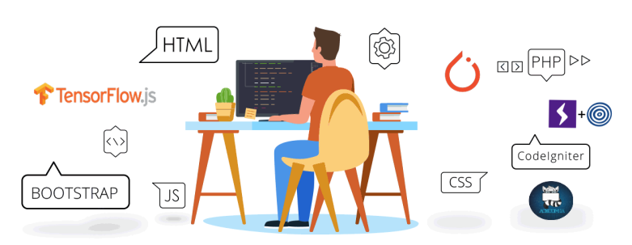

<h1 align="center">Hi, I'm CristhIAn Wiki</h1>

 
  
  
	
	

 

### 🤵 About Me

 

- I am versatile and easily adapt to different tasks. I love exploring new tech stack 💻 and leveraging them to build cool stuffs 🛠️.
- DL engineer 🤖 focused on Computer Vision
  .
- 💻 I use daily **.py**, **.cpp** and **.js**.
- ❤️ I love create and deploying Deep Learning models.
- 📫 How to reach [me](mailto:christiansanchezsaune@gmail.com).
- 🦝 Member of [ACECOM](https://www.facebook.com/acecom.uni/).
- 🌎 Check my **new website** [www.cristhianwiki.com](https://www.cristhianwiki.com/)

### 👨🏻‍💻 Languages and Tools

 
  <code></code>
  <code></code>
  <code></code>
  <code></code>
  <code></code>
  <code></code>
  <code></code>
  <code></code>
  <code></code>
  <code></code>
  <code></code>
  <code></code>
  <code></code>
  <code></code>
  <code></code>
  <code></code>
 

### ⚡ GitHub Stats

  <table cellspacing="0" cellpadding="0" style="border:none;">
    <tr>
      <td></td>
      <td></td>
    </tr>   
  </table>

### ✨ Main repositories

 

  

  

  
